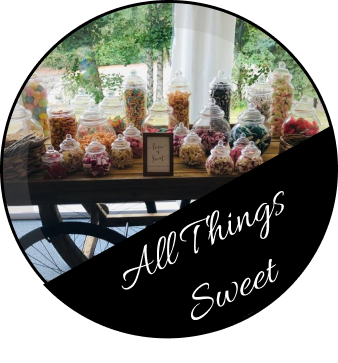

# Client Website Resign Project

This project is the redesign of a wedding planners website. I was given full creative control.

All the branding, logos and heading were designed using Figma by me. Examples of the designs can be found [here](https://www.figma.com/file/qEMYfIMq957FdBeKoG1B6G/Materials?node-id=0%3A1).
A couple of examples of the design are:

- The main redesigned logo for the business:
  
   
- One of the overlays I designed for the Services page:
  

This also included applying my skills in Html, CSS, Javascript and Responsive development (see [here](https://github.com/efarrant/1st-class-wedding-events/blob/a39a1c716c0d06c14a5a257dfe38bcc8e883a1c9/src/style.css#L284)).

Tools/frameworks used in this project include:

- [Bootstrap](https://getbootstrap.com/) for styling
- [Unsplash](https://unsplash.com/) for background and images
- [Figma](https://www.figma.com/) for design, wireframe and prototyping

I've also allowed the client to add addition photos to the services page and all sub-pages using a numbering system.

New website will shortly overtake the domain name: https://1stclassweddingevents.co.uk/
